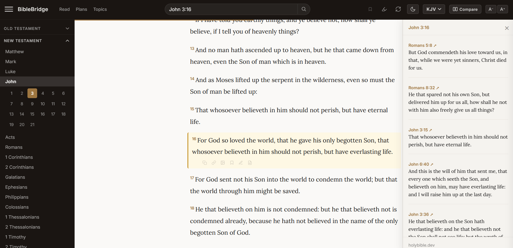

# BibleBridge

A complete Bible for your WordPress site — Scripture Atlas, cross-references, reading plans, KJV and BSB.

[Live Demo](https://holybible.dev/wp/bible/read) · [Install on WordPress](https://wordpress.org/plugins/biblebridge/) · [Pricing](https://holybible.dev/pricing)

96 Bible topics connected by shared verses — from core doctrine to everyday Christian life. [Open Scripture Atlas →](https://holybible.dev/wp/bible/scripture-atlas)

---

## Why most people never finish building this

Adding a Bible to a website sounds simple until you start.

First you need the text. So you find a SQL dump or CSV somewhere, import it, and immediately discover:

- Verses are missing — Psalm 119 cuts off at verse 150, 3 John is incomplete
- Pilcrow marks (`¶`) and zero-width characters scattered through the text
- Double spaces, curly quotes mixed with straight quotes, inconsistent punctuation
- Book names don't match across translations — is it "Psalms" or "Psalm"? "1 John" or "I John"?
- The schema is different for every source — some split book/chapter/verse into columns, some mash them into one string

So you normalize all of that. Then you need a second translation. Different source, different schema, different encoding problems. Repeat for every translation you want to support.

Now you have clean data and a normalized database. You still need:

- A reference parser that handles `John 3:16`, `1 Cor 13`, `Rev 21:1-4`, `Jn 3`, `1Cor13`, `Ps 23` — every abbreviation, shorthand, and numbered book format your users might type
- Full-text search that feels instant across 31,000+ verses
- Cross-references linking scripture across 66 books
- Reading plans with progress tracking and day-by-day navigation
- Topic modeling that shows how theological ideas relate to each other
- Bookmarks, highlights, notes, verse sharing, cloud sync, dark mode
- Mobile layout, URL routing, page speed

That's months of edge cases and data plumbing. Most projects stall somewhere between the database import and the reference parser.

**You do not need to build any of this.**

## What you get

Install from your WordPress admin and your site has:

- **Scripture Atlas** — 96 Bible topics connected by shared verses, from core doctrine to everyday Christian life
- **Cross-references** — tap any verse to see related passages
- **KJV and Berean Standard Bible (BSB)** — both public domain, both included on every plan
- **5 reading plans** — Bible in a Year, NT in 90 Days, NT in a Year, Gospel of John, Psalms & Proverbs
- **Full-text search** with book filtering
- **Verse shortcodes** — `[biblebridge_verse ref="John 3:16"]` or `[biblebridge_verse ref="Romans 8:1" version="bsb"]`
- **Verse of the day** — `[biblebridge_verse_of_the_day]`
- Verse sharing, highlighting, and notes
- Cloud sync across devices via a simple code (no account required)
- Dark mode and mobile layout

Every feature is included on every plan, including free.

## Install

1. In your WordPress admin, go to **Plugins → Add New**
2. Search for "BibleBridge" and click **Install Now**
3. Activate the plugin
4. Go to **Settings → BibleBridge** to set your reader name
5. Find your reader URL under **Page URL** in Settings and add it to your navigation menu

A free API key is provisioned automatically on activation — no signup required.

[Install on WordPress.org →](https://wordpress.org/plugins/biblebridge/)

## Source code

Every PHP, CSS, and JavaScript file ships as human-readable source in the plugin zip. No minification, no build step, no obfuscation. What you download is what runs.

## License

GPLv3. See [LICENSE](LICENSE) for details.
