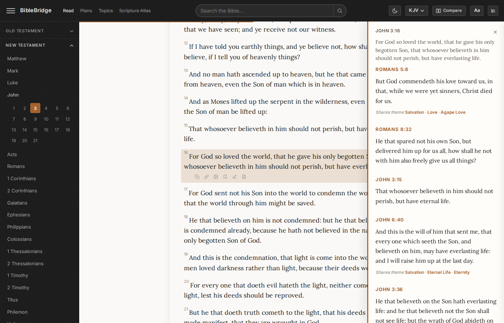
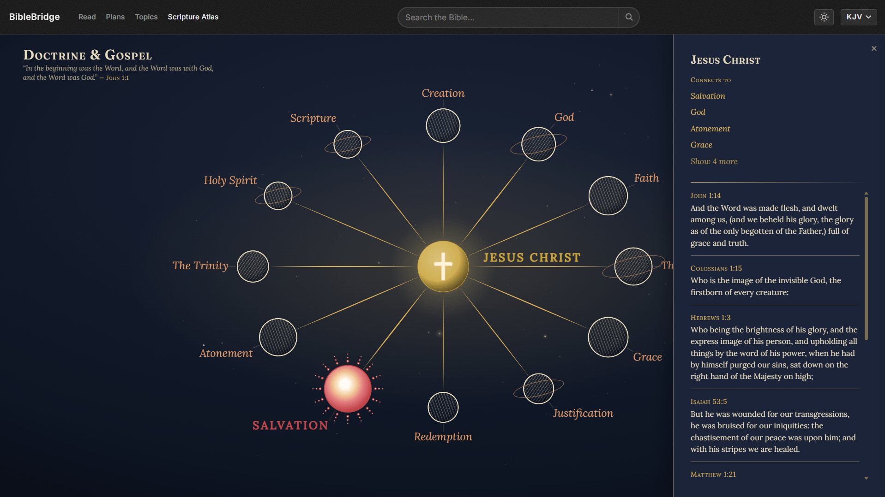

# BibleBridge

A complete Bible for your WordPress site: Scripture Atlas, cross-references, reading plans, KJV and BSB.

[Install on WordPress.org →](https://wordpress.org/plugins/biblebridge/) · [Live Demo](https://holybible.dev/bible/read) · [Pricing](https://holybible.dev/pricing)

## What you get

- **Scripture Atlas**: seven regions of connected Bible topics, from core doctrine to everyday Christian life. Embed anywhere with `[biblebridge_atlas region="doctrine-and-gospel"]`
- **Auto-Tagging**: turn it on once and every Bible reference in your posts and pages becomes an interactive verse automatically. No manual tagging
- **Cross-references**: tap any verse to see related passages
- **KJV and Berean Standard Bible (BSB)**: both public domain, both included on every plan
- **5 reading plans**: Bible in a Year, NT in 90 Days, NT in a Year, Gospel of John, Psalms & Proverbs
- **Full-text search** with book filtering
- **Verse shortcodes**: `[biblebridge_verse ref="John 3:16"]`
- Highlights, notes, verse sharing, and cloud sync across devices, no account required
- Dark mode and mobile layout

Every feature is included on every plan, including free.

## Install

1. In your WordPress admin, go to **Plugins → Add New**
2. Search for "BibleBridge" and click **Install Now**
3. Activate the plugin
4. Go to **Settings → BibleBridge** to set your reader name and add your reader URL to your navigation menu

A free API key is provisioned automatically on activation. No signup required.

[Install on WordPress.org →](https://wordpress.org/plugins/biblebridge/)

## Source and license

Every PHP, CSS, and JavaScript file ships as human-readable source in the plugin zip. No minification, no build step, no obfuscation.

GPLv2 or later. See [LICENSE](LICENSE) for details.
